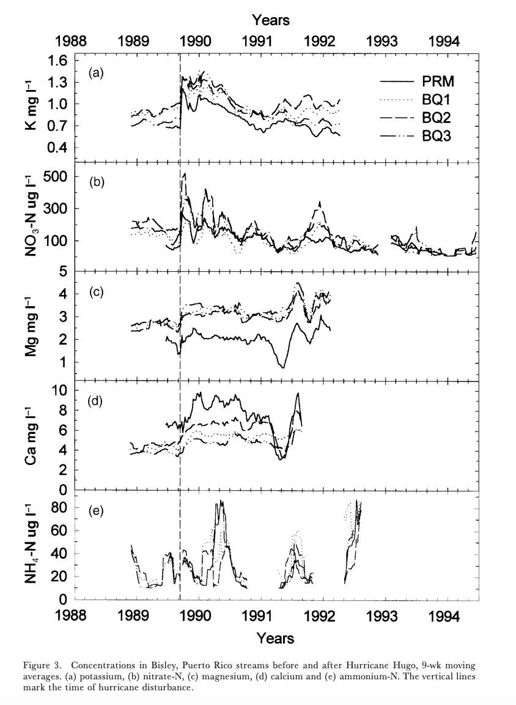
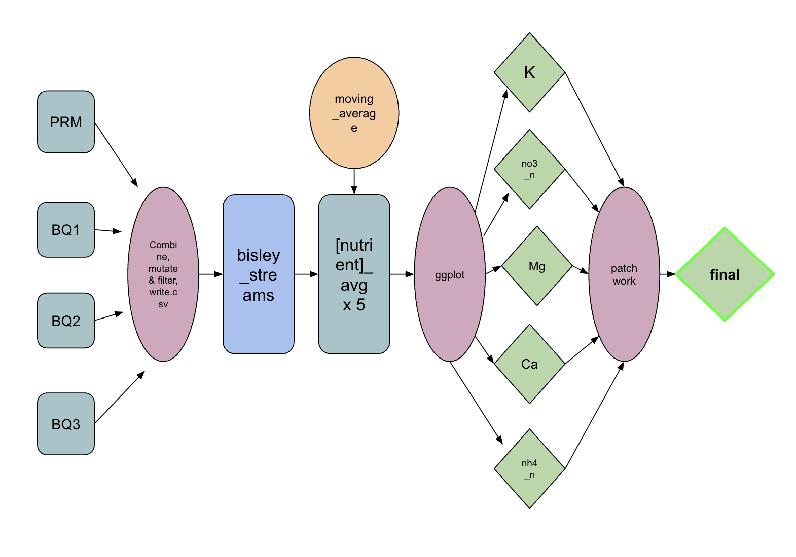

# EDS214: Final Project

## Sofia Sarak

This code attempts to replicate the above figure, which is Figure 3 of the following paper:

*Schaefer, Douglas. A., William H. McDowell, Fredrick N. Scatena, and Clyde E. Asbury. 2000. “Effects of Hurricane Disturbance on Stream Water Concentrations and Fluxes in Eight Tropical Forest Watersheds of the Luquillo Experimental Forest, Puerto Rico.”* Journal of Tropical Ecology 16 (2)*: 189–207. <https://doi.org/10.1017/s0266467400001358>.*

The figure and its respective analysis summarize the fluctuations of stream water chemistry of the Luquillo Experimental Forest of the Luquillo Mountains in Puerto Rico. It utilizes moving averages on a 9-week intervals of five different nutrients, data for which is available within the **data** folder of this repo, as well through the [Environmental Data Initiative](https://eds-214-workflows-reproducibility.github.io/course-materials/interactive/edirepository.org).

## Analysis

### 1. Data Cleaning and Wrangling (**01_data_wrangling.R**)

T Data wrangling followed these general steps:

1.  Reading in four different .csv files downloaded from the source mentioned above (raw data stored in **data** folder), simultaneously cleaning names and selecting for necessary columns.

2.  Combined all four data frames into one.

3.  Arranged data to be ascending by year, and selected for only the necessary years (1988 to 1995).

4.  Clean data saved as a .csv within the **outputs** folder.

### 2. Calculating Moving Averages (**02_moving_avg_calc.R**)

1.  Created a function to calculate moving average, with arguments for focal date, date vector, value vector, and week interval. In our case, we used a week interval of 9 weeks. (Function definition in **R** folder)

2.  Applied the moving average function to the entire cleaned data using sapply(). It was run five separate times for each of the five nutrients in the figure.

3.  Separate data frames for each nutrient calculated were saved and stored as .csv files the **outputs** folder.

### 3. Plotting (**03_figs.R**)

1.  Five separate plots were created from the five saved data sets, using ggplot. Specifications include:

    -   Line type defined by the variable sample_id, or site name

    -   Minimal theme (created our own)

    -   No x axis labels, except for the bottom plot

Each plot was saved as a separate png file in the **outputs** folder.

2.  The five plots were combined using the patchwork package and saved in **outputs** as final.png.

### Visual schematic for this workflow

### Notes:

For package installation, be sure to run "environment_initiation.R" in the project root.
